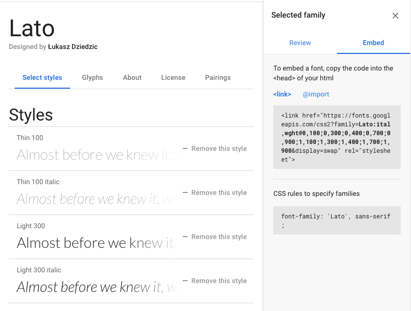
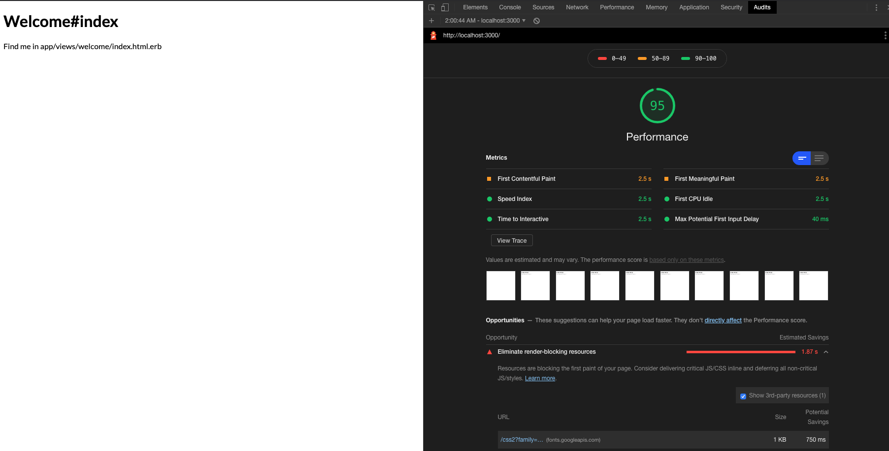
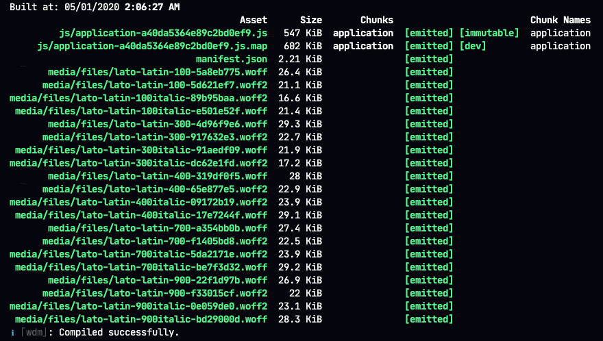
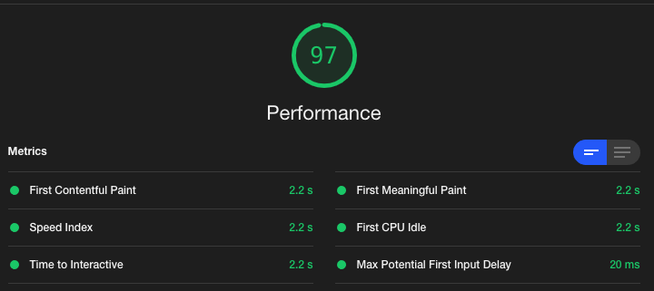

# Instantly speed up your Rails application by self-hosting your fonts

A font can make or break your design, and as a result many of us are probably not using the default system fonts. [Google Fonts](https://fonts.google.com) makes it really easy to find the perfect font, but it can come with a performance cost. If you are loading a font directly from Google, the following tutorial is guaranteed to speed up your Rails application.

To demonstrate, let's build a quick demo app.

This is a tutorial, but I will assume you have a basic understanding of Ruby on Rails. If not, and you need me to elaborate on anything, let me know in the comments.

## Create a new Rails project

```sh
rails new self_hosted_webfonts_demo --skip-sprockets --skip-spring
cd self_hosted_webfonts_demo
```

I am using Rails 6.0.2.2, which comes default with Webpacker 4.2.2, but I want to take advantage of features in v5, so I am going to update the gem and node package to v5.1.1. You are not required to do this in your application, but will need to if you are following along with this tutorial. Make sure you run `bundle install && yarn install`.

After we have upgraded webpacker, let's create a basic Welcome controller, and set the index as the root route in `config/routes.rb`:

```sh
bin/rails generate controller welcome index
```

```rb
# config/routes.rb

Rails.application.routes.draw do
  get "welcome/index"
  root "welcome#index"
end
```

## Choose a font

Now that we have a landing page, we should snazz it up a bit with a nice font. If you're like me, this is usually when you head over to [Google Fonts](https://fonts.google.com). To keep it simple, I am going to use [Lato](https://fonts.google.com/specimen/Lato). Since I am not too sure all the styles and weights I need right now, I will just go ahead and select all the available styles (sound familiar?) and copy the link that Google provides.



Now that we have our fonts, lets add the link to the head of our application in `app/views/layouts/application.html.erb` on the line above your `stylesheet_link_tag` (line #7 if you are on a fresh Rails app):

```html
<link href="https://fonts.googleapis.com/css2?family=Lato:ital,wght@0,100;0,300;0,400;0,700;0,900;1,100;1,300;1,400;1,700;1,900&display=swap" rel="stylesheet">
```

While we are here, let's change `stylesheet_link_tag` to `stylesheet_pack_tag` and create our application styles file:

```diff
- <%= stylesheet_link_tag "application", media: "all", "data-turbolinks-track": "reload" %>
+ <%= stylesheet_pack_tag "application", media: "all", "data-turbolinks-track": "reload" %>
```

```sh
touch `app/javascript/packs/application.scss`
```

Inside of `application.scss`, add the following CSS rules to specify the font family:

```scss
// app/javascript/packs/application.scss

html {
  font-family: 'Lato', sans-serif;
}
```

Now if we start the Rails server (`bin/rails s`), and navigate to `localhost:3000`, we should see our simple landing page being rendered with our nice, new font.


## The Problem...

Even though our view looks much better with the new font, we have just degraded the performance of our application and introduced a render blocking resource. When we load Lato, we are actually loading a stylesheet, and the browser will not render our page until it finishes retrieving the file from Google's servers.

Introducing a render blocking resource isn't great, but what's worse is we are now relying on Google to send us that file for us to render our page. Users will now be waiting longer for the page to load, and that time can change without warning as Google's server potentially come under heavy load.



Not great. Lighthouse isn't happy about it either.

However, there are solutions to this problem. I am going to show you the method I believe is the fastest to implement and easiest to understand, but understand there are several other fixes you could use instead with their own pros and cons.

## The Solution

Enter the [typefaces](https://www.bricolage.io/typefaces-easiest-way-to-self-host-fonts/) project from Gatsby founder [Kyle Mathews](https://twitter.com/kylemathews). I highly recommend reading about his motivations behind the project, but the TL;DR is we can use Webpacker to install fonts on our server and self-host them ourselves instead of relying on Google.

Since I am already hosting everything else on my server, it makes perfect sense in a Rails environment to take this approach - and it's super quick to swap out Google Fonts for this solution.

A quick search on NPM for `typeface lato` will reveal the package we are looking for, which we can easily install:

```sh
yarn add typeface-lato
```

Now lets remove the old way we were getting the font:

```diff
- <link href="https://fonts.googleapis.com/css2?family=Lato:ital,wght@0,100;0,300;0,400;0,700;0,900;1,100;1,300;1,400;1,700;1,900&display=swap" rel="stylesheet">
```

And the last step is requiring the package in our `application.js` pack:

```js
// app/javascript/packs/application.js
require("typeface-lato")
```

If we fire the Rails server back up and checkout `localhost:3000`, the font should still be Lato! A quick look at the `webpacker-dev-server` logs will reveal that we are now self-hosting the same font styles and weights that we were before:



Let's see if we have fixed the performance regression via Lighthouse:



## Summary

We should be good to go! This is a simple, quick migration, which will reduce your time to first meaningful paint, and overall performance. It is also easily overlooked (speaking from personal experience).

I won't be going into much detail, but this also positions you to make further enhancement's, like requiring the font's in a separate pack and and take advantage of `javascript_packs_with_chunks_tag`.

Hopefully this was helpful! Let me know what idea's for further enhancements in the comments, I am curious to try some out!

Happy coding!
